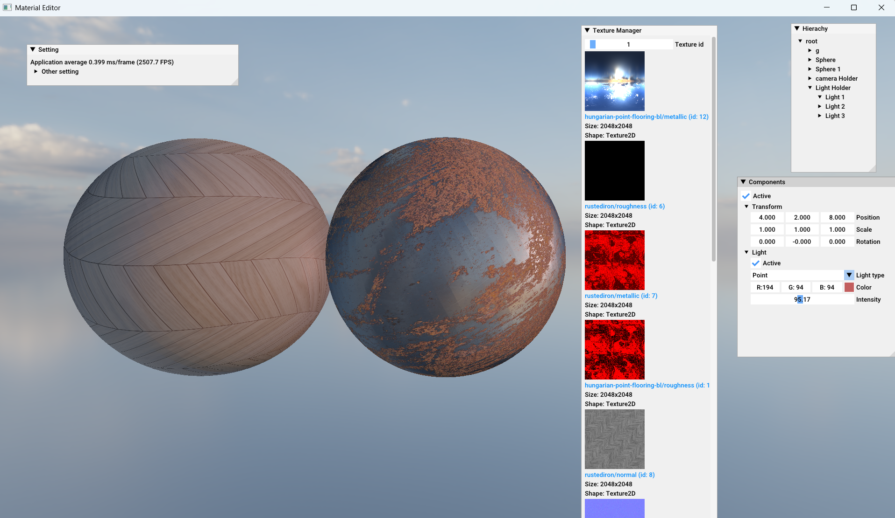

# Project ME: PBR Material Editor

Project ME is a Windows desktop prototype for inspecting and tuning **Physically Based Rendering (PBR)** materials in a real-time 3D preview. It is built from scratch in C++ and OpenGL, with a lightweight scene/component architecture and a Dear ImGui editor interface.

The project focuses on showing how material inputs and lighting conditions affect a PBR surface, rather than on being a full production-ready DCC application.

## Preview



## Features

### PBR Material Inspector

- Inspect base-color, metallic, roughness, normal, and ambient-occlusion maps.
- Tune base color and use scalar fallbacks for metallic and smoothness when texture maps are disabled.
- Enable or disable metallic, roughness, and normal-map usage during preview.
- Adjust UV tiling and offset for the selected material.
- Preview texture thumbnails in the editor.
- Material model support for emission, height/parallax, alpha clipping, transparency, render face selection, blending, and environment reflections.

### Real-Time Lighting Preview

- Directional, point, and spot light types.
- Interactive light-type selection, color, active state, and intensity controls.
- Lighting model support for ambient, diffuse, specular, attenuation, range, and spot-cone parameters.
- Live shader updates for active scene lights and materials.

### PBR Environment Lighting

- HDR equirectangular environment conversion to a cubemap.
- Irradiance-map convolution for diffuse image-based lighting.
- Prefiltered environment map generation for specular reflections.
- BRDF lookup texture generation for the PBR workflow.
- Skybox rendering and framebuffer-based scene preview.

### Editor and Rendering Architecture

- Scene hierarchy and component inspector built with Dear ImGui.
- Texture registry panel with texture metadata and previews.
- GameObject/component model for renderers, lights, cameras, and transforms.
- OpenGL 3.3 core context created through GLFW and loaded with GLEW.
- GLSL shader pipeline for PBR, environment conversion, irradiance, prefiltering, and framebuffer rendering.

## Technology Stack

- C++17
- OpenGL 3.3
- GLFW
- GLEW
- GLM
- Dear ImGui
- Assimp
- stb_image
- Visual Studio solution and MSBuild

## Project Structure

```text
Core/
  Components/              GameObject and component model
  Events/                  Input and event dispatching
  Manager/                 Component, texture, and material managers
  Render/
    Camera/                Camera and camera controls
    Lighting/              Directional, point, and spot lights
    Object/                Mesh, material, texture, shader, and renderer
    RenderingSystem/       PBR environment and framebuffer rendering
  Scene/                   Scene and scene-rendering management
  UI/                      Dear ImGui hierarchy, inspector, and texture panels
Resources/
  GLSL/                    Runtime shaders
  images/                  Sample PBR texture sets
  ibl/                     HDR environment maps
Dependencies/              Third-party headers and project dependencies
third-party/               Dear ImGui, stb_image, and ImGuiFileDialog sources
```

## Design Documentation

[`Design Proj/Material Editor.vpp`](Design%20Proj/Material%20Editor.vpp) is a [Visual Paradigm](https://www.visual-paradigm.com/) project containing an early, high-level view of class relationships in the application.

It is intended as a design aid for understanding the main application, scene, component, rendering, material, and lighting areas. The diagram is not a complete UML specification and may not reflect every class or the latest implementation detail.

## Build

### Requirements

- Windows 10 or later.
- Visual Studio with the **Desktop development with C++** workload.
- A Windows SDK installed through Visual Studio Installer.
- A C++17-capable MSVC toolset.
- [vcpkg](https://github.com/microsoft/vcpkg) for the native library binaries.

Install the required x64 dependencies:

```powershell
vcpkg install glew:x64-windows glfw3:x64-windows assimp:x64-windows
```

### Visual Studio Setup

1. Open `Material Editor.sln` in Visual Studio.
2. Retarget the solution to an installed Windows SDK and C++ platform toolset if Visual Studio requests it.
3. Select `Release | x64`.
4. Ensure the linker can locate the vcpkg x64 library directory, usually `C:\vcpkg\installed\x64-windows\lib`.
5. Link against `glew32.lib`, `glfw3dll.lib`, `opengl32.lib`, and the Assimp library name provided by your vcpkg installation, such as `assimp-vc145-mt.lib`.
6. Copy `glew32.dll` and `glfw3.dll` from `C:\vcpkg\installed\x64-windows\bin` next to the generated executable before running it.

The checked-in Visual Studio project references an older toolset and SDK version. Retargeting is expected on a newer development environment.

## Current Scope

The current prototype loads sample texture sets from `Resources/` for material preview. A general file-import workflow for arbitrary user texture sets is not yet exposed through the editor UI.

## Notes

This is an educational graphics and rendering project. Third-party libraries and assets remain subject to their respective licenses.
